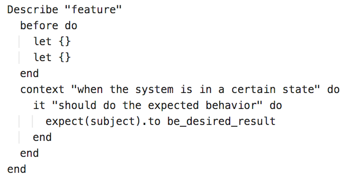

RSpec Rubric
===================

We here on ReviewSite,  got a certain way of doin' thangs.  Specifically for RSpec, we follow this rubric for writing our test files. Write your tests this way and everything will be dandy. 
For more information, check out the techniques described on [BetterSpecs][1]!

RSpec example
--------

Use "describe" to denote which feature you are testing. When referring to a class method, use the "." or the "::" notation.
When referring to an instance method, use the "#" notation.
Ex) describe "Array.first"
Ex) describe "user#say_hello"

Descriptions should be short (ideally < 40 characters).

When talking about how a feature should behave for a particular state (i.e. the user has no username), use "context".
Context descriptions should begin with "when" or "with".
Ex) context "when the user has no username"

General RSpec & Testing rules:

1. Keep your tests as isolated as possible
2. Use the "expect" keyword instead of "should" as Rspec aims to deprecate "should".
3. Use let() and let!() instead of creating instance variables. Let() and let!() lazy load data (i.e. they don't create the variable until it is needed).
   Learn more about let [here][2]

[1]: http://betterspecs.org
[2]: http://makandracards.com/makandra/1300-using-rspec-s-late-resolving-of-let-variables-for-cleaner-specs
